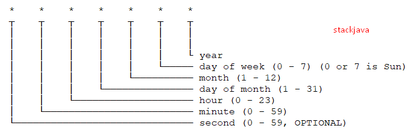
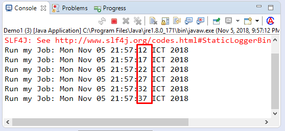
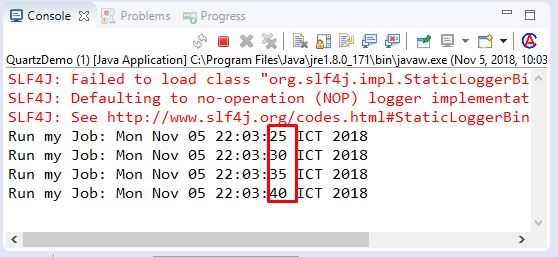

# Cron expression là gì? Hướng dẫn cú pháp cron expression

## 1. Quartz Scheduler là gì?

Quartz là một thư viện, một framework mã nguồn mở cho phép bạn lên lịch các công việc theo một thời gian định nghĩa trước (bao lâu thì lặp lại 1 lần, chạy trong những thời gian nào…)

Quartz có 3 thành phần cơ bản:

* Task/Job: Đây chính là các tác vụ cần thực thi trong chương trình(chứa code xử lý business logic)
* Listener: Đây là 1 thành phần của framework, framework sẽ gọi đến thành phần này tạo cho bạn cơ hội chạy code trong một số trường hợp như khi tác vụ bắt đầu, kết thúc hoặc bị từ chối (bị cấm) .
* Trigger: Tạo ra mối quan hệ giữa 2 thành phần kể trên, và có khả năng thiết lập các khoảng thời gian theo mẫu hình để tác vụ có thể được thực thi(Ví dụ: mỗi 5 phút, 5h sáng hàng ngày, ...)

### 1.1. Job task

Job task đại diện cho các tác vụ mà chương trình của bạn phải cần phải xử lý. Ví dụ như tổng hợp tỉ giá giao dịch chứng khoán trong cơ sở dữ liệu và gửi email về số liệu cho khách hàng, xuất báo cáo, ... có thể là bất cứ nghiệp vụ nào khác 😄

Lưu ý: trong khi khai báo Quartz job bạn phải implement org.quartz.Job interface. Trong ví dụ này là in ra Hello world

```java
package vuta.quartz.example;

import org.quartz.Job;
import org.quartz.JobExecutionContext;
import org.quartz.JobExecutionException;

public class HelloJob implements Job {
	
	public void execute(JobExecutionContext context) throws JobExecutionException {
		
		System.out.println("Hello World!");
	}

}
```

### 1.2. Job listener

Lưu ý: trong khi khai báo Quartz listener bạn phải implement org.quartz.JobListener interface, 4 phương thức bên dưới sẽ được override

* getName: Trả về tên của job listener.
* jobToBeExecuted: Quartz sẽ gọi phương thức này khi tác vụ chuẩn bị được thực thi.
* jobExecutionVetoed: Quartz sẽ gọi phương thức này khi việc thực hiện tác vụ bị cấm từ trigger.
* jobWasExecuted: Quartz sẽ gọi phương thức này khi tác vụ đã được thực thi.

```java
package vuta.quartz.example;

import org.quartz.JobExecutionContext;
import org.quartz.JobExecutionException;
import org.quartz.JobListener;

public class HelloJobListener implements JobListener {

	public String getName() {
		return "HelloJobListener";
	}

	public void jobToBeExecuted(JobExecutionContext context) {

		final String jobName = context.getJobDetail().getKey().toString();
		System.out.println("jobToBeExecuted: " + jobName + " is starting...");

	}

	public void jobExecutionVetoed(JobExecutionContext context) {
		System.out.println("jobExecutionVetoed");
	}

	public void jobWasExecuted(JobExecutionContext context, JobExecutionException jobException) {
		System.out.println("jobWasExecuted");

		final String jobName = context.getJobDetail().getKey().toString();
		System.out.println("Job : " + jobName + " is finished!!");

		if (!jobException.getMessage().equals("")) {
			System.out.println("Exception thrown by: " + jobName + " Exception: " + jobException.getMessage());
		}
	}
}

```

### 1.1.3 Trigger

Trigger đại diện cho mối quan hệ giữa tác vụ và listener, nó chịu trách nhiệm tạo tác vụ, tạo listener, tạo các sự kiện (dựa trên khoảng thời gian)

```java
package vuta.quartz.example;

import org.quartz.CronScheduleBuilder;
import org.quartz.JobBuilder;
import org.quartz.JobDetail;
import org.quartz.JobKey;
import org.quartz.Scheduler;
import org.quartz.Trigger;
import org.quartz.TriggerBuilder;
import org.quartz.impl.StdSchedulerFactory;
import org.quartz.impl.matchers.KeyMatcher;

public class HelloCronTrigger {

	public static void main(String[] args) throws Exception {

		final JobKey jobKey = new JobKey("HelloName", "group1");
		final JobDetail job = JobBuilder.newJob(HelloJob.class).withIdentity(jobKey).build();

		final Trigger trigger = TriggerBuilder.newTrigger().withIdentity("HelloTriggerName", "group1")
				.withSchedule(CronScheduleBuilder.cronSchedule("0/5 * * * * ?")).build();

		final Scheduler scheduler = new StdSchedulerFactory().getScheduler();

		// Listener attached to jobKey
		scheduler.getListenerManager().addJobListener(new HelloJobListener(), KeyMatcher.keyEquals(jobKey));

		scheduler.start();
		scheduler.scheduleJob(job, trigger);
	}
}

```

## 2. Cron expression là gì?

Cron expression là một đoạn text với định dạng gồm 6 hoặc 7 trường để xác định lịch chạy cho một phương thức, hàm, ứng dụng.
</img>

Cron expression được sử dụng trong Java (Spring Scheduling Task, Quartz), trong Node.js (node-schedule)…

Mỗi trường trong cron expression chỉ được phép nhận các giá trị sau đây:

|Trên trường|	Bắt buộc |Giá trị cho phép |Các ký tự đặc biệt cho phép|
|------------|------------------|--------------|------|
|Seconds 	|Có| 	0-59 |	, – * /|
|Minutes 	|Có| 	0-59 |	, – * /|
|Hours 	|Có |	0-23 |	, – * /|
|Day of month 	|Có |	1-31 |	, – * ? / L W|
|Month 	|Có |	1-12 or JAN-DEC| 	, – * /|
|Day of week 	|Có| 	1-7 or SUN-SAT |	, – * ? / L #|
|Year 	|Không 	|	|, – * /|

Trường thứ 7, tức là trường Year trong cron expression là không bắt buộc (đặc biệt ví dụ như trong Spring Schedule nó chỉ chấp nhận 6 trường đầu tiên).

Các ký tự đặc biệt trong Cron Expression
<ul>
<li>
 * (“all values”) – được sử dụng cho tất cả cả trường. Ví dụ nếu sử dụng ở trường hours có nghĩa là chạy hàng giờ.
  </li><li>  ? (“no specific value”) – nhận giá trị bất kỳ
    </li><li> - – sử dụng để chỉ rõ khoảng được chạy. Ví dụ, “10-12” trong trường hours có nghĩa là chạy từ 10h đến 12h (10h,11h,12h)
    </li><li> , – sử dụng để liệt kê các giá trị. Ví dụ, “MON,WED,FRI” trong trường day-of-week có nghĩa là chạy vào các ngày thứ hai, thứ tư và thứ sáu.
    </li><li> / – sử dụng để chỉ rõ số lần tăng. Ví dụ, “0/15” hoặc “*/15” trong trường seconds nghĩa là cứ 15s chạy một lần.
    </li><li> L (“last”)<ul>
       <li> Nếu sử dụng trong trường day-of-month thì có nghĩa là ngày cuối cùng của tháng (ví dụ: “L” ngày cuối cùng của tháng,
        </li><li>Nếu sử dụng trong trường day-of-week thì có nghĩa là ngày thứ bảy, nếu có 1 giá trị trước L, ví dụ “6L” tức là ngày thứ 6 cuối cùng của tháng</li></ul>
    </li><li> W (“weekday”) – sử dụng để chỉ rõ ngày trong tuần gần nhất với ngày truyền vào. Ví dụ “15W” trong trường day-of-week nghĩa là ngày trong tuần gần nhất với ngày 15 của tháng. Ví dụ ngày 15 là thứ bảy thì nó sẽ chạy vào ngày thứ sáu.

   </li><li> # – sử dụng để chỉ rõ thứ tự của ngày trong tháng. Ví dụ “6#3” trong trường day-of-week có nghĩa là ngày thứ sáu lần thứ 3 trong tháng. (một tháng có 4 hoặc 5 ngày thứ sáu thì sẽ chạy vào ngày thứ sáu xuất hiện ở lần thứ 3)
</li><li>  Các ký tự trong trường months và day-of-week không phân biệt chữ hoa / thường. FRI giống với fri</li>
</ul>


## 3.Cài quartz qua maven

Trường hợp sử dụng maven, các bạn thêm dependency sau đây vào file pom.xml

```xml
    <dependency>
      <groupId>org.quartz-scheduler</groupId>
      <artifactId>quartz</artifactId>
      <version>2.2.1</version>
    </dependency>
    <dependency>
      <groupId>org.quartz-scheduler</groupId>
      <artifactId>quartz-jobs</artifactId>
      <version>2.2.1</version>
    </dependency>
```

## 4. Ví dụ Cron expression

|Expression |	Ý nghĩa|
|------------|------------------|
|0 0 12 * * ? 	|12h chiều hàng ngày
|0 15 10 ? * * 	|10:15:00 hàng ngày
|0 15 10 * * ? 	|10:15:00 hàng ngày
|0 15 10 * * ? * |	10:15:00 hàng ngày
|0 15 10 * * ? 2005 |	10:15:00 hàng ngày – trong năm 2005
|0 * 14 * * ? 	|Vào đầu mỗi phút chạy một lần, trong khoảng từ 14h – 14h59
|0 0/5 14 * * ? 	|5 phút chạy một lần từ 14h đến 14h55
|0 0/5 14,18 * * ? 	|5 phút chạy một lần từ 14h-14h55 và 18h-18h55
|0 0-5 14 * * ? 	|1 phút chạy một lần từ 14h00-14h05
|0 10,44 14 ? 3 WED 	|chạy vào lúc 14h10 và 14h44 vào tất cả các ngày thứ 3 của tháng 3
|0 15 10 ? * MON-FRI 	|chạy vào lúc 10h15 trong các ngày thứ hai đến thứ sáu
|0 15 10 15 * ? 	|chạy vào lúc 10h15 ngày 15 hàng tháng
|0 15 10 L * ? 	|chạy vào lúc 10h15 trong ngày cuối cùng của tháng
|0 15 10 ? * 6L 	|chạy vào lúc 10h15 của thứ sáu cuối cùng của tháng
|0 15 10 ? * 6L 2002-2005 	|chạy vào lúc 10h15 của thứ sáu cuối cùng của tháng, trong các năm 2002-2005


## 5. Code ví dụ

Thư viện sử dụng:

```xml
    <project xmlns="http://maven.apache.org/POM/4.0.0" xmlns:xsi="http://www.w3.org/2001/XMLSchema-instance"
      xsi:schemaLocation="http://maven.apache.org/POM/4.0.0 http://maven.apache.org/xsd/maven-4.0.0.xsd">
      <modelVersion>4.0.0</modelVersion>
      <groupId>stackjava.com</groupId>
      <artifactId>QuartzExample</artifactId>
      <version>0.0.1-SNAPSHOT</version>
      <properties>
        <maven.compiler.target>1.8</maven.compiler.target>
        <maven.compiler.source>1.8</maven.compiler.source>
      </properties>
      <dependencies>
        <dependency>
          <groupId>org.quartz-scheduler</groupId>
          <artifactId>quartz</artifactId>
          <version>2.2.1</version>
        </dependency>
        <dependency>
          <groupId>org.quartz-scheduler</groupId>
          <artifactId>quartz-jobs</artifactId>
          <version>2.2.1</version>
        </dependency>
      </dependencies>
    </project>
```


Home » quartz » Code ví dụ Java đặt lịch với Quartz Scheduler
Code ví dụ Java đặt lịch với Quartz Scheduler
Posted on Tháng Chín 15, 2018

Code ví dụ Java đặt lịch với Quartz Scheduler.

(Xem thêm: Code ví dụ Java đặt lịch với Timer, TimerTask)

(Xem thêm: Code ví dụ Spring Boot tạo lịch với annotation @Scheduled)
1. Quartz Scheduler là gì?

Quartz là một thư viện, một framework mã nguồn mở cho phép bạn lên lịch các công việc theo một thời gian định nghĩa trước (bao lâu thì lặp lại 1 lần, chạy trong những thời gian nào…)
2. Cài đặt Quartz

Trong bài này mình sẽ thực hiện cài đặt bản 2.2:

2.1 Cài đặt qua file .jar

Các bạn download file  Quartz 2.2.3.tar.gz và giải nén, sau đó import các file .jar vào trong project java

Code ví dụ Java đặt lịch với Quartz Scheduler

2.2 Cài quartz qua maven

Trường hợp sử dụng maven, các bạn thêm dependency sau đây vào file pom.xml

    <dependency>
      <groupId>org.quartz-scheduler</groupId>
      <artifactId>quartz</artifactId>
      <version>2.2.1</version>
    </dependency>
    <dependency>
      <groupId>org.quartz-scheduler</groupId>
      <artifactId>quartz-jobs</artifactId>
      <version>2.2.1</version>
    </dependency>

3. Code ví dụ

Các công nghệ sử dụng:

    Maven
    JDK 1.8
    Eclipse

Tạo Maven Project

Code ví dụ Java đặt lịch với Quartz Scheduler

Cấu trúc Project

Code ví dụ Java đặt lịch với Quartz Scheduler

Thư viện sử dụng:

    pom.xml

    <project xmlns="http://maven.apache.org/POM/4.0.0" xmlns:xsi="http://www.w3.org/2001/XMLSchema-instance"
      xsi:schemaLocation="http://maven.apache.org/POM/4.0.0 http://maven.apache.org/xsd/maven-4.0.0.xsd">
      <modelVersion>4.0.0</modelVersion>
      <groupId>stackjava.com</groupId>
      <artifactId>QuartzExample</artifactId>
      <version>0.0.1-SNAPSHOT</version>
      <properties>
        <maven.compiler.target>1.8</maven.compiler.target>
        <maven.compiler.source>1.8</maven.compiler.source>
      </properties>
      <dependencies>
        <dependency>
          <groupId>org.quartz-scheduler</groupId>
          <artifactId>quartz</artifactId>
          <version>2.2.1</version>
        </dependency>
        <dependency>
          <groupId>org.quartz-scheduler</groupId>
          <artifactId>quartz-jobs</artifactId>
          <version>2.2.1</version>
        </dependency>
      </dependencies>
    </project>

Tạo Job (Task, Công việc)

```java
    package stackjava.com.quartzexample;
    import java.util.Date;
    import org.quartz.*;
    public class MyJob implements Job{
      public void execute(JobExecutionContext arg0) throws JobExecutionException {
        System.out.println("Run my Job: "+ new Date());
      }
    }
```


* Để tạo Job trong quartz, ta implement interface org.quartz.Job
* Method execute chính là công việc mà Job thực hiện, ở đây công việc của mình thực hiện là in ra màn hình thời gian hiện tại.

Demo1.java

```java
    package stackjava.com.quartzexample;
    import org.quartz.*;
    import org.quartz.impl.StdSchedulerFactory;
    public class Demo1 {
      public static void main(String[] args) throws SchedulerException {
        Trigger trigger = TriggerBuilder.newTrigger().withIdentity("triggerName", "group1")
            .withSchedule(SimpleScheduleBuilder.simpleSchedule().withIntervalInSeconds(5).repeatForever()).build();
        
        JobDetail job = JobBuilder.newJob(MyJob.class)
            .withIdentity("jobName", "group1").build();
          Scheduler scheduler = new StdSchedulerFactory().getScheduler();
          scheduler.start();
          scheduler.scheduleJob(job, trigger);
      }
    }

```


</img>


* Trigger: thực hiện định nghĩa lịch chạy cho Job. Trong ví dụ này mình tạo lịch đơn giản với SimpleScheduleBuilder để thực hiện lặp lại 5 giây một lần và thực hiện mãi mãi. Các bạn có thể thực hiện lặp lại theo giờ, theo phút… với các method withIntervalInHours, withIntervalInMinutes. Hoặc giới hạn số lần lặp với withRepeatCount
*    JobDetail: Sử dụng để định nghĩa thể hiện của Job. Ở đây mình link tới job là class MyJob.java
*    Scheduler: Đây là API chính dùng để giao tiếp với scheduler (cho biết trigger nào gắn với Job nào)


Demo2.java

```java
    package stackjava.com.quartzexample;
    import org.quartz.*;
    import org.quartz.impl.StdSchedulerFactory;
    public class Demo2 {
      public static void main(String[] args) throws SchedulerException {
        Trigger trigger = TriggerBuilder.newTrigger().withIdentity("triggerName", "group1")
            .withSchedule(CronScheduleBuilder.cronSchedule("0/5 1-30 * * * ?")).build();
        JobDetail job = JobBuilder.newJob(MyJob.class).withIdentity("jobName", "group1").build();
        Scheduler scheduler = new StdSchedulerFactory().getScheduler();
        scheduler.start();
        scheduler.scheduleJob(job, trigger);
      }
    }
```


</img>

* Với SimpleScheduleBuilder thì ta chỉ có thể lên lịch một cách đơn giản. Nhưng với những trường hợp phức tạp (chạy vào thời gian nào, trong khoảng nào, loại trừ những thời gian nào…) thì ta cần phải sử dụng CronScheduleBuilder
* CronScheduleBuilder sử dụng cú pháp cron expression để định nghĩa lịch chạy.
* Trong ví dụ này mình định nghĩa lịch chạy là "0/5 1-30 * * * ?" tức là cứ 5s lặp lại một lần, và chỉ chạy trong phút thứ 1 đến phút thứ 30 của các giờ.


## ref
* https://stackjava.com/quartz/code-vi-du-java-dat-lich-voi-quartz-scheduler.html
* https://stackjava.com/uncategorized/cron-expression-la-gi-huong-dan-cu-phap-cron-expression.html
* https://viblo.asia/p/java-quartz-scheduler-gAm5ywAVZdb